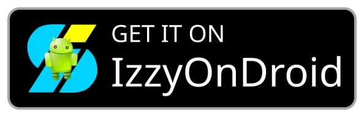

# Murine Launcher (Launcher :3)

## About

A lightweight FOSS Android launcher forked from AOSP's Launcher3, using [yuchuangu85's repo](https://github.com/yuchuangu85/Launcher3) as a base.

It offers minimalistic but modern and clean custom looks and feel, and essential customization options without bloat.

## Compatibility

Murine Launcher currently supports Androd 8 and above

Blur effects are supported on Android 12 and above. 
Some OEM/ROMs may hide or disable window-level blurs; if that's your case try to check for an &quot;Allow window-level blurs&quot; option in Display Options or Developer Options. 
Alternatively, try enabling <a href="https://github.com/Magisk-Modules-Alt-Repo/enable-blurs">this Magisk module</a> on rooted devices

## Screenshots
    
    
    

## Download

Check [the website](https://www.murinelauncher.app/) or download it from:

  <a href="https://f-droid.org/en/packages/app.murinelauncher">
    <picture>
      <source media="(prefers-color-scheme: dark)" srcset="image/github/badge-fdroid.webp" height="60">
      
    </picture>
  </a>
  <a href="https://apt.izzysoft.de/fdroid/index/apk/app.murinelauncher">
    <picture>
      <source media="(prefers-color-scheme: dark)" srcset="image/github/badge-izzyondroid.webp" height="60">
      
    </picture>
  </a>
  <a href="https://play.google.com/store/apps/details?id=app.murinelauncher">
    <picture>
      <source media="(prefers-color-scheme: dark)" srcset="image/github/badge-google-play.webp" height="60">
      
    </picture>
  </a>
  <a href="https://github.com/alesimula/Murine-launcher/releases">
    <picture>
      <source media="(prefers-color-scheme: dark)" srcset="image/github/badge-github.webp" height="60">
      
    </picture>
  </a>

## Building

Last tested on:

 - Android Studio: Panda 2 (2025.3.2)
 - Gradle: 9.3.1 (bundled)

## Buy me a beer

## Credits

- [Preview art by Miikrowelle](https://miikrowelle.straw.page)
- [Contains some icons from Lets Icons by sadik sajid](https://www.figma.com/community/plugin/1551156216287797438)

## Extra resources

 - [Recovery: User-initiated, offline crash log sharing with zero permissions](https://github.com/alesimula/Recovery)
 - [murine-aircompressor: full-Java zstd, lz4, snappy and lzo implementations](https://github.com/alesimula/murine-aircompressor)
 - [Old resources: just some trash I don't want to clutter my main repo](https://github.com/alesimula/old-resources-m-launcher)